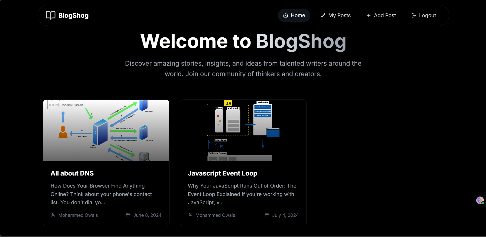

# BlogShog 📝

[](https://github.com/owaismohammed79/BlogShog/blob/main/LICENSE) 

BlogShog is a modern blogging application built with React and Appwrite, designed for creating, managing, and sharing blog posts effortlessly. It leverages powerful libraries and tools to provide a rich editing experience, seamless state management, and smooth navigation.

## Features
- Rich text blog editor powered by TinyMCE
- User authentication and backend powered by Appwrite
- Responsive UI with Tailwind CSS animations
- State management using Redux Toolkit
- FontAwesome and Lucide icons integration
- Client-side routing with React Router DOM
- Form handling with React Hook Form

## Demo Video
[](https://screenrec.com/share/s5xnTjlhK2)

## Installation

1. **Clone the repository**  
```bash
git clone https://github.com/owaismohammed79/BlogShog.git
cd BlogShog
```

2. **Install dependencies**  
Make sure you have Node.js and npm installed. Then run:  
```bash
npm install
```

3. **Configure environment variables**  
Create a `.env` file based on `.env.example` and fill in your Appwrite project details and API keys.

4. **Start the development server**  
```bash
npm run dev
```

The app will be available at `http://localhost:5173` (or the port Vite assigns).

## Usage

- **Creating posts:** Use the rich text editor to compose and format your blog posts.
- **Authentication:** Sign up or log in using your Appwrite credentials.
- **Navigation:** Browse posts, create new ones, or edit existing blogs with intuitive UI controls.
- **Preview & Publish:** Preview posts before publishing to ensure content quality.
- **Responsive Design:** Access your blogs on any device with a polished responsive interface.

To build for production, run:  
```bash
npm run build
```
And preview the production build locally with:  
```bash
npm run preview
```

## Contributing

Contributions are welcome! Please fork the repository, create a feature branch, and submit a pull request.  


## License

This project is licensed under the MIT License. See the [LICENSE](https://github.com/owaismohammed79/BlogShog/blob/main/LICENSE) file for details.

